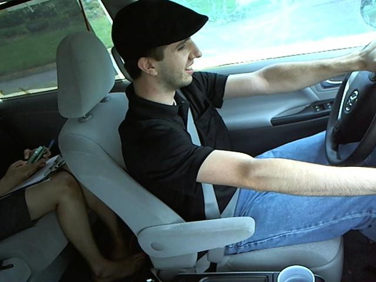

# Distracted-Driver-Detection
Given driver images, each taken in a car with a driver doing something in the car (texting, eating, talking on the phone, makeup, reaching behind, etc) the goal is to predict the likelihood of what the driver is doing in each picture.

In this project, we have created and refined machine learning models to detect what the driver is doing in a car given driver images. This is done by predicting the likelihood of what the driver is doing in each picture.

# Problem Statement
The goal of this project is to predict the activity of a driver in a car from an image taken from the car's camera. The dataset used in this project is the StateFarm dataset, consisting of ~22.4K labelled images with 10 classes and an additional 79.7K unlabelled test images. The ten classes include safe driving, texting (right and left hand), talking on the phone (right and left hand), operating the radio, drinking, reaching behind, hair and makeup, and talking to passenger(s).

# Data Exploration
The StateFarm dataset has coloured images with 640 x 480 pixels each. We have ten classes, with each class equally represented in the dataset.

There are 10 classes including safe driving in the dataset:
- c0	Safe driving.
- c1	Texting (right hand).
- c2	Talking on the phone (right hand).
- c3	Texting (left hand).
- c4	Talking on the phone (left hand).
- c5	Operating the radio.
- c6	Drinking.
- c7	Reaching behind.
- c8	Hair and makeup.
- c9	Talking to passenger(s). 

Driver texting right  
  

Driver operating the radio  

This dataset is available on Kaggle, under the State Farm competition:
https://www.kaggle.com/c/state-farm-distracted-driver-detection

# Data Preprocessing
We split the dataset into training, validation, and testing sets. We resize the images to 224 x 224 pixels, normalize the pixel values by dividing by 255, and center the data by subtracting 0.5 from each value.

# Approach
Initially, a standard CNN architecture was created and trained. The architecture consisted of 4 convolutional layers with 4 max pooling layers in between. The filters were increased from 64 to 512 in each of the convolutional layers. Dropout was used along with a flattening layer before the fully connected layer. The CNN had 2 fully connected layers with the number of nodes in the last layer set up as 10 with softmax activation function. Relu activation function was used for all other layers. Xavier initialization was used in each of the layers.

# Refinement
After the initial CNN architecture was evaluated, transfer learning was applied to VGG16, and 2 architectures for the fully connected layer were investigated. Model Architecture1 showed good results and was further improved by implementing the following techniques:
* Adding a dropout layer to prevent overfitting.
* Using Xavier initialization instead of random initialization of weights.
* Ensuring zero mean by subtracting 0.5 during pre-processing.
* Training the model for 400 epochs with a batch size of 16.
* Selecting VGG16 with Model Architecture1 and applying fine-tuning with SGD optimizer, using a slow learning rate of 1e-4 and a momentum of 0.9.
