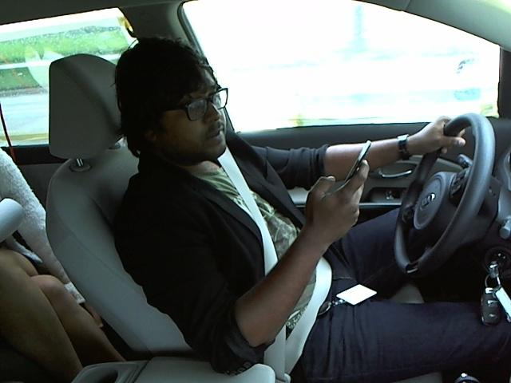

# Distracted-Driver-Detection
Given driver images, each taken in a car with a driver doing something in the car (texting, eating, talking on the phone, makeup, reaching behind, etc) the goal is to predict the likelihood of what the driver is doing in each picture.

In this project, we have created and refined machine learning models to detect what the driver is doing in a car given driver images. This is done by predicting the likelihood of what the driver is doing in each picture.

# Problem Statement
Given driver images, each taken in a car with a driver doing something in the car (texting, eating, talking on the phone, makeup, reaching behind, etc). Our goal is to predict the likelihood of what the driver is doing in each picture.

# Data Exploration
We have taken the StateFarm dataset which contains snapshots from a video captured by a camera mounted in the car. Training set has ~22.4 K samples with equal distribution among the classes and 79.7 K unlabeled test samples. There are 10 classes of images:

There are 10 classes including safe driving in the dataset:
- c0	Safe driving.
- c1	Texting (right hand).
- c2	Talking on the phone (right hand).
- c3	Texting (left hand).
- c4	Talking on the phone (left hand).
- c5	Operating the radio.
- c6	Drinking.
- c7	Reaching behind.
- c8	Hair and makeup.
- c9	Talking to passenger(s).

The images are coloured and have 640 x 480 pixels each as shown below  

Driver texting right  
  

Driver operating the radio  

This dataset is available on Kaggle, under the State Farm competition:
https://www.kaggle.com/c/state-farm-distracted-driver-detection

# Data Preprocessing
- split data into training and validation set and testing set.
- Images are resized to square image of size 224 x 224 pixels
- Image pixel values are normalised by dividing by 255 and mean is zero centered by substracting 0.5 from each value after normalization

# Implimentation
A standard CNN architecture was initially created and trained. We have created 4 convolutional layers with 4 max pooling layers in between. Filters were increased from 64 to 512 in each of the convolutional layers. Also dropout was used along with flattening layer before using the fully connected layer. Altogether the CNN has 2 fully connected layers. Number of nodes in the last fully connected layer were setup as 10 along with softmax activation function. Relu activation function was used for all other layers.Xavier initialization was used in each of the layers.

# Refinement
To get the initial result simple CNN architecture was built and evaluated. This resulted in a decent loss. The public score for the initial simple CNN
architecture(initial unoptimized model) was 2.67118. After this to further improve the loss, transfer learning was applied to VGG16 along with investigating 2 types of architectures for fully connected layer. Model Architecture1 showed good results and was improved further by using the below techniques
* Drop out layer was added to account for overfitting.
* Xavier initialization was used instead of random initialization of weights
* Zero mean was ensured by subtracting 0.5 during Pre-processing.
* Training was carried out with 400 epochs and with a batch size of 16
* To further improve the loss metric ,VGG16 along with Model Architecture1 was selected and fine-tuning was applied. SGD optimiser was used with very slow learning rate of 1e-4. A momentum of 0.9 was applied with SGD.

# Approach
# Results
The comparison of the Public Scores for all the model architectures considered for this data set is shown in Fig

# Future Work
Bulid end2end detection interface using above model.
# Installation
